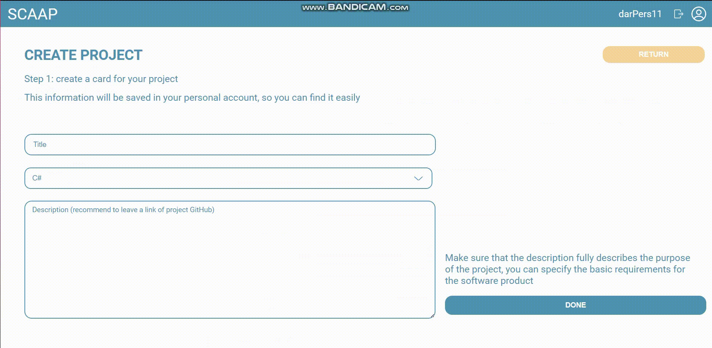
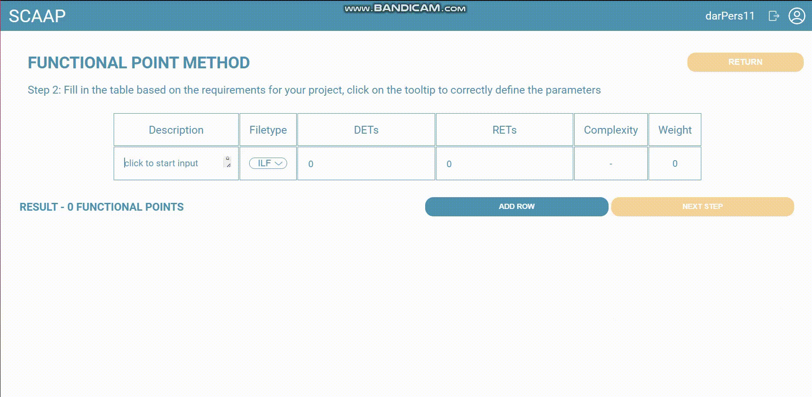

# Software-complexity-assessment-application
Software complexity assessment application is a web application designed to easily and more accurately calculate the complexity and size of a software product based on its requirements by methods COCOMO II and functional points methods.

The personal profile contains information about the complexity assessment of the user's software products.

### Project creation

### Functional points method to get an complexity of software product
The function point method is used to estimate the development time at the early stages of the project, for example, at the logical and conceptual design stage. To use this method it is necessary to have a list of requirements to the software being developed. The accuracy of the estimation depends on the level of requirements detailing.  
This method is used to estimate developers' labor productivity and workload. The result of the analysis is a certain number of functional points, which can be used to estimate the size of the software product.

### COCOMO II method to get an complexity of software product
Estimating the complexity of the software product at this stage depends on the quantity of function points obtained at the previous stage. The estimate of complexity at this stage is determined by the COCOMO II methodology and is defined in the number of people and months required to develop the project. 

COCOMO II takes into account personnel qualifications, personnel experience, product complexity and reliability, development platform complexity, development for reuse, equipment (rudimentary/integrated lifecycle support tools).

## Technologies
React, Node JS, Express, PostgreSQL.

## How to run the application
To run the system correctly, your computer must be equipped with the Node.js platform version 18.16.1. You can download official installation packages for all major operating systems from https://nodejs.org. Also make sure you have PostgreSQL and PgAdmin for database management installed on your computer. You can get the official installation packages from https://www.enterprisedb.com/downloads/postgres-postgresql-downloads.  
To create a database, log into PgAdmin, create a new database or select an existing database, and import the database dump from the scaapp_db.sql file using the Restore option after right-clicking on the database.  
To view the code, it is recommended to use well-known code editors, such as Visual Studio Code from Microsoft, which can be downloaded from the official website https://code.visualstudio.com.  
To properly connect the server part of the application with the database, edit the values of the pool object fields (user, password, host, port, database) in the db.js file located in the backend folder.  
To download the necessary Node.js modules, open Visual Studio Code, navigate to the project folder, run the "npm install" command in the terminal and wait for the download to complete. This will install all the dependencies specified in the package.json file.  
Start the web application using the "npm start" command in the backend folder to start the server side and in the frontend/scaap-frontend folder to start the client. Wait for the local server to start successfully.